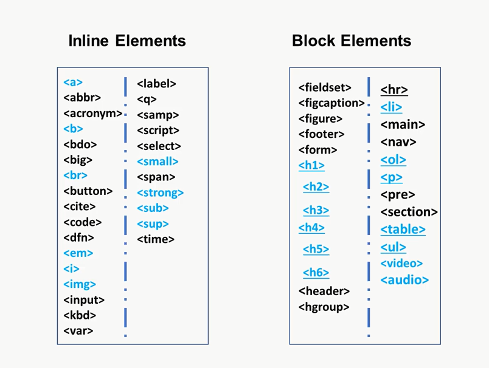
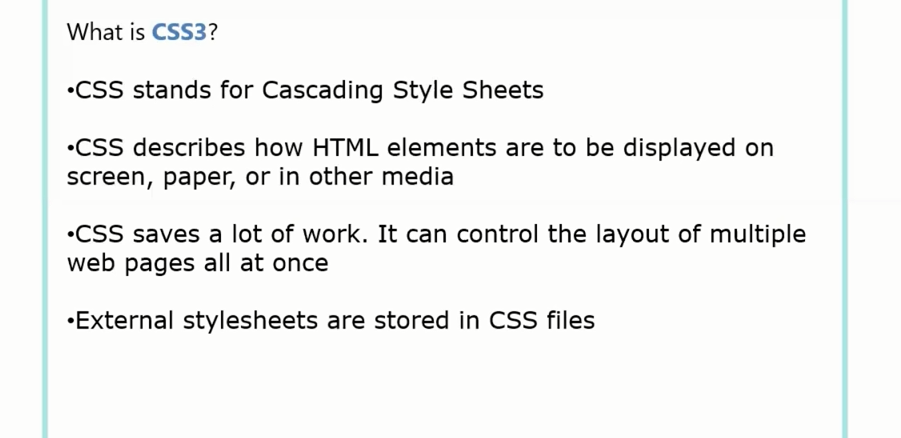

## HTML
#### HTML5 Quotation Marks
•<b> - Bold text  
•<strong> - Important text  
•<i> - Italic text  
•<em> - Emphasized text  
•<mark> - Marked text  
•<small> - Smaller text  
•<del> - Deleted text  
•<ins> - Inserted text  
• - Subscript text  
• - Superscript text  
#### Anchor Tags
(<a>) simply add target='_blank' in anchor if want to open a new tab  
#### Table Tags
To create a table in a webpage, we use some specific tags :
▪ <table> tag is used to make a table, with attribute “border” so
that it can make a border of the table.  
▪ <tr> tag is used to specify table row. To define each row, we
first need to write the table row tag.  
▪ <th> tag stands for table head, which is used to define the
headings of the first row. So, inside the first row <tr>, we use
the <th> tag.  
▪ <td> tag stands for table data. We will write our cell data using
the td tag. 

</table>
    
    

